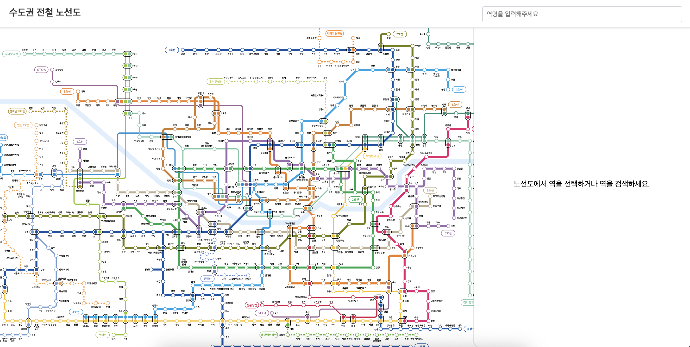
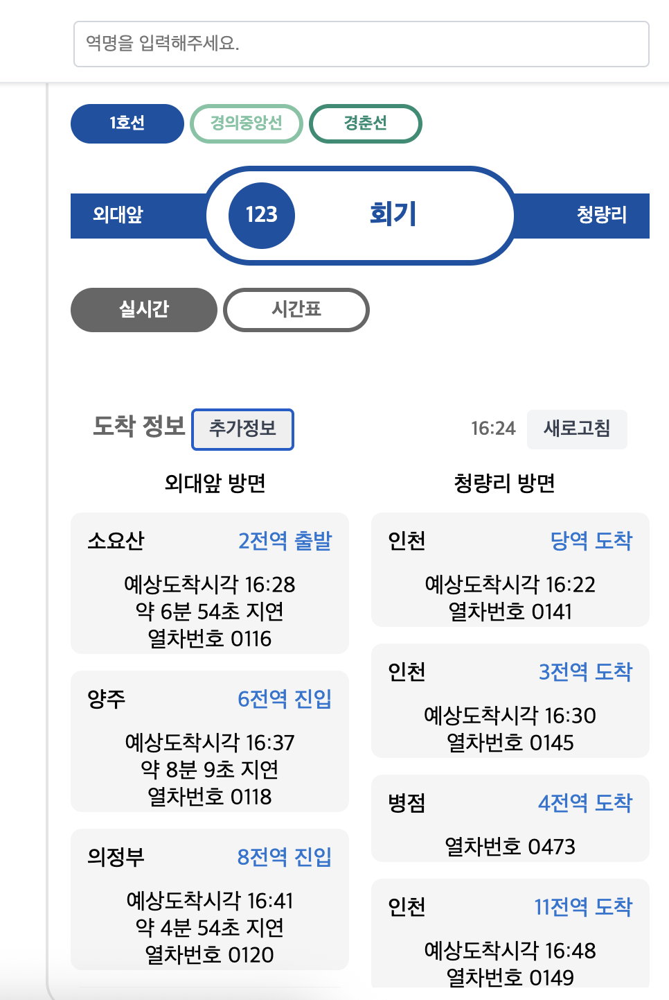
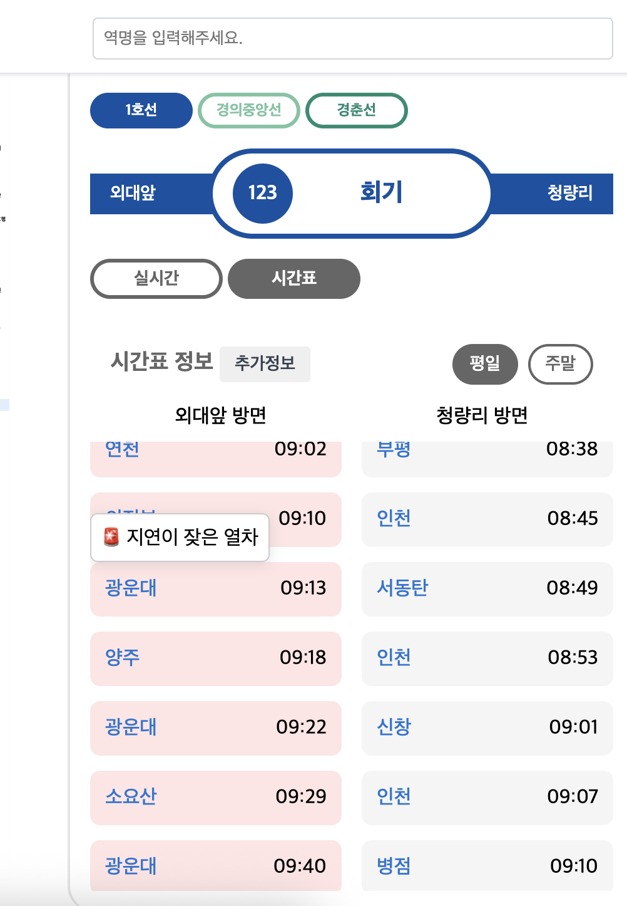
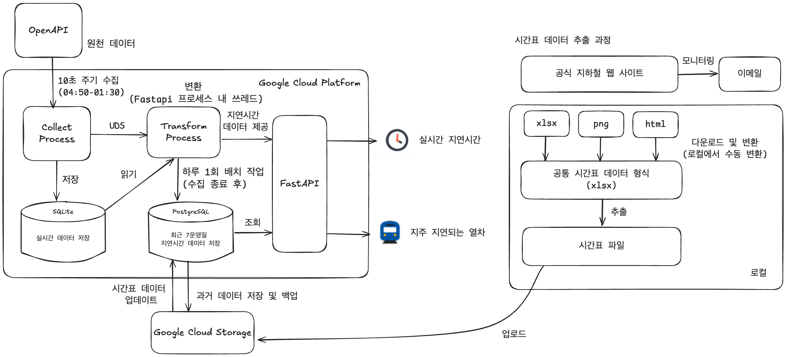

# Metronow
서울 실시간 지하철 지연정보 서비스

Korea Seoul metro web service that provides live information with delay time.

Check this site:
https://metronow.info

## 개발 및 운영 기간
개발: 2024.08 ~ 2025.02
운영 및 개선: 2025.02 ~ 현재 운영중 

## 핵심기능

실시간 지하철 지연정보를 제공하는 서비스입니다.
아래와 같이 두 가지 지연 정보를 제공합니다.

| 실시간 지연정보 | 지연이 잦은 열차 |
|-------|-------|
|   |   |
| 실시간으로 열차의 지연 정보를 제공합니다. | 수집한 지연시간 데이터를 요약하여 지연이 잦은 열차 정보를 제공합니다.|

## 지연정보 데이터 파이프라인
최대한 정확한 지연정보를 지속적으로 제공하기 위해 구성한 데이터 파이프라인

- 10초 주기로 실시간 지하철 데이터를 수집하여 지연시간 정보를 계산.
- 매일 1회 지하철 운영이 모두 끝난 시점에 지연 정보 산출 및 과거 데이터 업로드 
- 시간표 최신화를 위해 공식 웹사이트를 모니터링하여 

### 데이터 출처
|데이터 종류| 데이터 출처|세부 출처|
|------|-------|------|
|실시간 데이터| 서울 열린 데이터 광장 | 서울시 지하철 실시간 열차 위치정보 (https://data.seoul.go.kr/dataList/OA-12601/A/1/datasetView.do)|
|||서울시 지하철 실시간 도착정보 (https://data.seoul.go.kr/dataList/OA-15799/A/1/datasetView.do)|
|시간표 데이터| 공식 지하철 운영사 웹사이트| 코레일(https://www.letskorail.com/ebizcom/cs/guide/guide/guide11.do#)|
|||서울교통공사(http://www.seoulmetro.co.kr/kr/board.do?menuIdx=546)|
|||지하철 9호선(https://www.metro9.co.kr/bbs/BBSMSTR_000000000001/list.do)|
|||공항철도(https://www.arex.or.kr/content.do?url=&menuNo=MN201504230000000001&contentNo=&clientLocale=ko_KR&clientDevice=Normal)|
|||GTX-A(https://www.gtx-a.com/ptl/notice/bltn/viewGongJiList.do)|
|||우이신설선(https://www.ui-line.com/html/info/info01/info_01_00.php?nowPage=1)|
|||신분당선(https://www.shinbundang.co.kr/index.jsp?open_main=3&open_sub1=1&open_sub2=0&pageID=%2Fnotice%2Fnotice1.jsp&flag=)|
|||신림선(http://www.sillimlrt.com/kr/html/sub03/0301.html)|
|||의정부경전철(https://www.ulrt.co.kr/doc/bbs/board.php?bo_table=nr_notice)|
|||용인에버라인(https://www.ever-line.co.kr/board/list.php?M2_IDX=28958)|
|||김포골드라인(https://gimpogoldline.com/?page_id=596)|

### 활용한 기술
`python`, `pandas`, `FastAPI`, `SQlite`, `PostgreSQL`

### 문의
thinkcat0128@gmail.com

